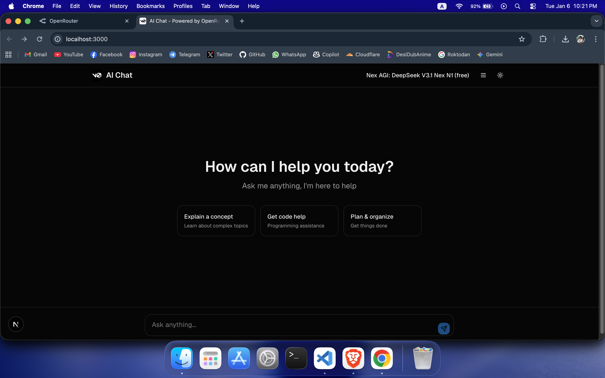
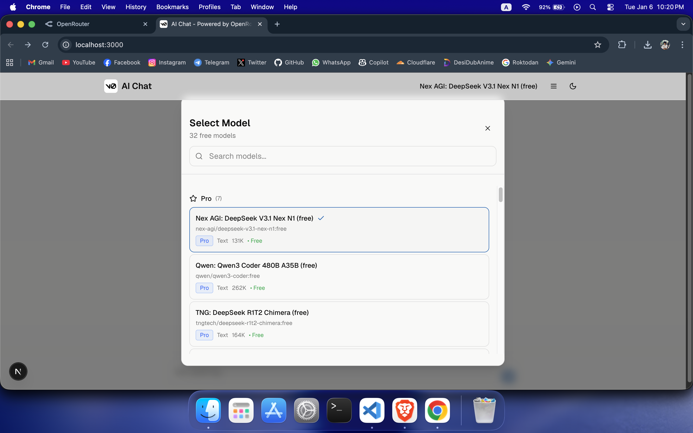
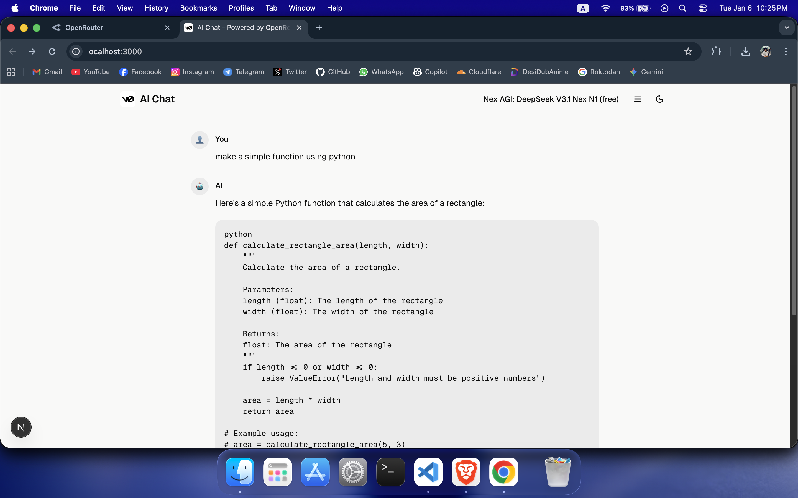
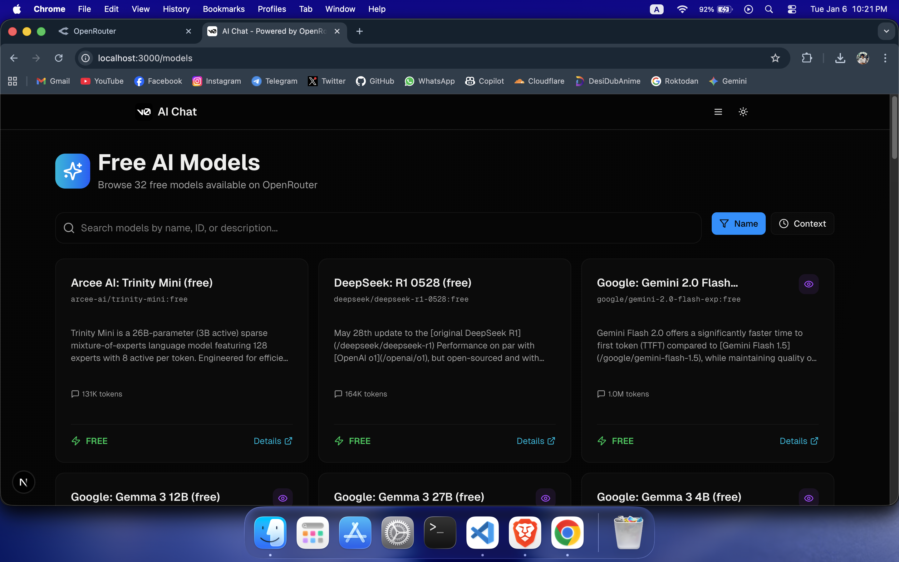

# AI Chat Application

A modern, feature-rich AI chat application powered by OpenRouter's API, providing access to hundreds of free AI models with an intuitive interface.

## 📸 Screenshots

### Light Mode


### Dark Mode


### Model Selection


### Chat with AI


### Models Browser


## ✨ Features

### 🤖 Multiple AI Models
- Access to **hundreds of free AI models** from OpenRouter
- Smart categorization into 5 performance tiers:
  - **Ultra**: Cutting-edge flagship models (GPT-5, Claude Opus 4, O3)
  - **Pro**: High-performance production models (GPT-4o, Claude 3.7, DeepSeek R1)
  - **Fast**: Quick, efficient models (Flash, Mini, Nano variants)
  - **Normal**: Balanced general-purpose models
  - **Slow**: Older models, still functional

### 💬 Advanced Chat Interface
- Auto-resizing text input
- Press **Enter** to send, **Shift+Enter** for new lines
- Real-time streaming responses
- Clean side-by-side message layout
- Markdown support in responses

### 🔍 Model Browser
- **[/models](/models)** - Browse all available free models
- Search by name, ID, or description
- Filter by context length or name
- Detailed model specifications including:
  - Context window size
  - Vision capabilities
  - Provider information
  - Model descriptions

### 📚 Documentation
- **[/docs](/docs)** - Complete documentation
- Quick start guide
- Feature overview
- API configuration instructions
- Model category explanations
- Tips and tricks

### 🎨 Modern UI/UX
- Clean, minimal design inspired by ChatGPT
- Dark/Light theme toggle
- Responsive layout for all devices
- Smooth transitions
- Simple, intuitive navigation

## 🚀 Getting Started

### Prerequisites
- Node.js 18+ installed
- OpenRouter API key (get one free at [openrouter.ai](https://openrouter.ai))

### Installation

1. Clone the repository:
```bash
git clone <repository-url>
cd ai-chat-app
```

2. Install dependencies:
```bash
npm install
# or
pnpm install
```

3. Configure your API key:

Edit `config/index.ts` and add your API key(s) to the `apiKeys` array:
```typescript
export const CONFIG = {
  // ...
  apiKeys: [
    "sk-or-v1-your-api-key-here"
  ],
  // ...
}
```

4. Start the development server:
```bash
npm run dev
# or
pnpm dev
```

5. Open [http://localhost:3000](http://localhost:3000) in your browser

## 📖 Usage

### Chat Interface
1. Navigate to the home page
2. Click the model selector button
3. Choose a model from the categorized list
4. Start typing your message
5. Press Enter to send (Shift+Enter for new line)

### Browse Models
- Visit `/models` to see all available free models
- Use the search bar to find specific models
- Sort by name or context length
- Click "Details" to learn more about any model

### Documentation
- Visit `/docs` for complete documentation
- Learn about features, configuration, and tips

## 🛠️ Configuration

### API Keys
Edit `config/index.ts`:
```typescript
apiKeys: ["sk-or-v1-..."],
```

### Features
Enable/disable features in `config/index.ts`:
```typescript
features: {
  allowCustomModels: true,
  imageGenerationEnabled: true,
}
```

### Custom Models
Add custom models in `config/index.ts`:
```typescript
customModels: [
  {
    id: "custom/model-id",
    name: "Custom Model",
    provider: "Custom",
    enabled: true,
  },
],
```

## 📁 Project Structure

```
ai-chat-app/
├── app/
│   ├── page.tsx              # Main chat interface
│   ├── models/page.tsx       # Models browser page
│   ├── docs/page.tsx         # Documentation page
│   └── api/
│       ├── chat/route.ts     # Chat API endpoint
│       ├── models/
│       │   ├── route.ts      # All models endpoint
│       │   └── free/route.ts # Free models only (filtered)
│       └── generate-image/   # Image generation endpoint
├── components/
│   ├── chat-area.tsx         # Chat interface component
│   ├── chat-message.tsx      # Message display component
│   ├── navigation.tsx        # Top navigation bar
│   ├── model-selector.tsx    # Model selection modal
│   └── ui/                   # Reusable UI components
├── lib/
│   ├── api-config.ts         # API configuration
│   └── developer-config.ts   # Developer settings
└── config/
    └── index.ts              # Main configuration file
```

## 🔧 API Endpoints

### `GET /api/models/free`
Fetches only truly free models (pricing = $0) with categorization
- Filters models where both prompt and completion pricing are $0
- Returns models organized by tier (Ultra, Pro, Fast, Normal, Slow)
- Includes custom models from config
- Response: `{ models, categorizedModels, customModels, total }`

### `GET /api/models`
Fetches all available models from OpenRouter
- Returns all models without filtering
- Response: `{ models, total }`

### `POST /api/chat`
Sends a chat message to the selected model
- Body: `{ apiKey, model, message, messages }`
- Response: `{ content }`

### `POST /api/generate-image`
Generates an image from a text prompt
- Body: `{ apiKey, model, message }`
- Response: `{ content: imageUrl }`

## 🎨 Customization

### Theme
The application supports dark and light themes. Toggle using the moon/sun icon in the navigation bar.

### Styling
Built with Tailwind CSS. Customize colors, spacing, and more in:
- `tailwind.config.js` - Theme configuration
- `app/globals.css` - Global styles
- Component files - Component-specific styles

## 🔒 Security Notes

- API keys in `config/index.ts` are used server-side
- Never commit real API keys to version control
- Use environment variables for production deployments
- For production, consider implementing proper API key rotation

## 🤝 Contributing

Contributions are welcome! Please follow these steps:
1. Fork the repository
2. Create a feature branch (`git checkout -b feature/amazing-feature`)
3. Commit your changes (`git commit -m 'Add amazing feature'`)
4. Push to the branch (`git push origin feature/amazing-feature`)
5. Open a Pull Request

## 📝 License

This project is open source and available under the MIT License.

## 🙏 Acknowledgments

- [OpenRouter](https://openrouter.ai) - API provider
- [Next.js](https://nextjs.org) - React framework
- [Tailwind CSS](https://tailwindcss.com) - Styling
- [Radix UI](https://www.radix-ui.com) - UI components
- [Lucide Icons](https://lucide.dev) - Icon library

## 📞 Support

For issues, questions, or suggestions:
- Open an issue on GitHub
- Check the [documentation](/docs)
- Visit [OpenRouter documentation](https://openrouter.ai/docs)

---

**Built with ❤️ using Next.js and OpenRouter API by @anbuinfosec**
